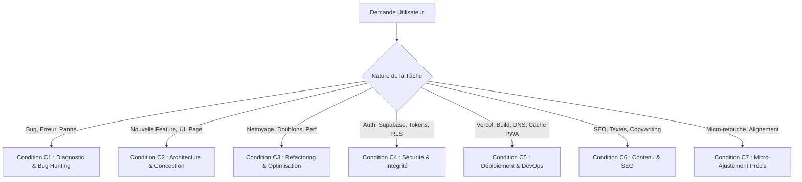

# 🧠 Matrice d'Exécution & Conditions de Prompt Engineering — Agence IA

Ce référentiel formalise l'ensemble des principes, techniques et conditions d'ingénierie de prompts et d'exécution agentique. Pour chaque tâche demandée par l'utilisateur, l'agent identifie et applique **la condition exacte la plus adaptée**.

---

## 🎯 Classification & Sélection Automatique des Conditions

---

## 📋 Table des Conditions par Catégorie de Tâche

### 🔍 Condition C1 : Diagnostic & Traque Systématique des Bugs (Root Cause Analysis)
* **Quand l'appliquer** : Erreur console, rejet de connexion, blocage asynchrone, 4xx/5xx, redirection indésirable.
* **Protocole d'exécution** :
  1. **Isoler la cause racine réelle** : Ne jamais masquer le symptôme par du CSS ou un timeout artificiel sans comprendre la source.
  2. **ReAct & Tracing** : Inspecter le flux réseau (requête REST, headers, statut HTTP, payload retourné).
  3. **Vérifier les verrous et promesses** : S'assurer que chaque promesse possède un garde-fou (`timeout`, `try/catch/finally` garanti).
  4. **Tester directement** : Valider la correction avec des tests ou des scripts de diagnostic avant de conclure.

---

### 🎨 Condition C2 : Architecture & Conception de Nouvelles Fonctionnalités
* **Quand l'appliquer** : Création d'une page, d'une modale, d'un composant, d'un nouveau flux métier.
* **Protocole d'exécution** :
  1. **Conformité stricte "STYLE A"** : Respecter la charte visuelle (Sidebar 20% + Workspace large + KPIs horizontaux + Grille 2 colonnes).
  2. **Zéro composant orphelin** : Toujours relier le nouveau composant à la navigation principale et à l'état global (`AppState`).
  3. **Esthétique Rich & Moderne** : Palette soignée, typographie moderne (Plus Jakarta Sans / Inter), micro-animations et aucun placeholder.
  4. **Cohérence Mobile & Desktop** : S'assurer que le rendu est 100% responsive et fluide sur smartphone.

---

### ⚡ Condition C3 : Refactoring, Nettoyage & Élimination des Doublons
* **Quand l'appliquer** : Code dupliqué, fonctions écrasées par ordre de chargement, dette technique, ralentissement.
* **Protocole d'exécution** :
  1. **Principe DRY (Don't Repeat Yourself)** : Supprimer impitoyablement toute fonction factice ou redondante.
  2. **Scope Unifié** : Centraliser les variables d'état et exposer uniquement ce qui est nécessaire sur l'objet global `window`.
  3. **Non-Régression** : Vérifier que la suppression d'un bloc ne casse aucun gestionnaire d'événement existant.

---

### 🛡️ Condition C4 : Sécurité, Authentification & Données Supabase
* **Quand l'appliquer** : Inscription, Connexion, Mots de passe, RLS, Webhooks, API keys.
* **Protocole d'exécution** :
  1. **Sécurité Défensive** : Assainir toutes les entrées utilisateur (XSS, injections SQL).
  2. **Résolution Dynamique des Origines** : Toujours utiliser `getAppBaseUrl()` pour `redirectTo` / `emailRedirectTo`.
  3. **Fallbacks Résilients** : Prévoir une authentification de secours (OTP in-app, codes maîtres, messages explicites).
  4. **Isolation Client/Serveur** : Ne jamais exposer de `SERVICE_ROLE_KEY` côté client.

---

### 🚀 Condition C5 : Déploiement, Vercel, DNS, Cache-Busting & PWA
* **Quand l'appliquer** : Déploiement Git, règles de routage SPA, Service Worker, configuration Vercel.
* **Protocole d'exécution** :
  1. **Domaine Canonique Strict** : Rediriger vers l'URL officielle (`credit-track00.vercel.app`).
  2. **Cache-Busting Systématique** : Incrémenter le numéro de build (`v4.x.x`) sur les bundles JS/CSS et `CURRENT_BUILD`.
  3. **Stratégie Service Worker** : `updateViaCache: 'none'`, Network-First sur le HTML, purge du cache obsolète.
  4. **Validation de Build** : Tester `npm run build` et vérifier le code de sortie 0 avant chaque publication.

---

### ✍️ Condition C6 : Contenu Métier, SEO & Localisation Panafricaine
* **Quand l'appliquer** : Textes, métadonnées OpenGraph/Twitter, devises, moyens de paiement locaux.
* **Protocole d'exécution** :
  1. **Pertinence Culturelle & Locale** : Adapter les devises (FCFA, GHS, NGN...) et les méthodes de paiement (Wave, MTN MoMo, Orange Money...).
  2. **SEO Premium** : Balises `title`, `description`, `og:image`, `canonical`, `manifest` complètes et sans template par défaut.
  3. **Ton Professionnel** : Vocabulaire commercial clair, adapté aux commerçants et gérants de boutiques.

---

### 🔧 Condition C7 : Micro-Ajustements Précis & Retouches Rapides
* **Quand l'appliquer** : Changement d'un libellé, ajustement d'un espacement, modification d'un bouton.
* **Protocole d'exécution** :
  1. **Chirurgical** : Modifier uniquement les lignes ciblées sans réécrire l'ensemble du fichier.
  2. **Vérification Immédiate** : Vérifier que l'icône, le texte et le comportement au clic restent fonctionnels.

---

## 🛠️ Principes d'Ingénierie de Prompts & Méthodologie Cognitive

### 1. Structure Obligatoire de Pensée (Chain-of-Thought + ReAct)
* **Comprendre** : Analyser le besoin exact, les contraintes et les pièges potentiels.
* **Planifier** : Définir les étapes ordonnées avant toute modification.
* **Agir** : Exécuter les changements avec des outils spécialisés.
* **Vérifier** : Tester en conditions réelles et prouver le bon fonctionnement.

### 2. Checklist d'Excellence avant Livraison
- [ ] La cause racine est-elle réellement résolue ?
- [ ] Le code respecte-t-il la charte visuelle STYLE A ?
- [ ] Les tests de build et d'exécution sont-ils validés sans erreur ?
- [ ] Le numéro de build et le cache-busting sont-ils mis à jour ?
- [ ] La réponse est-elle claire, sans fausse promesse et immédiatement utile ?
